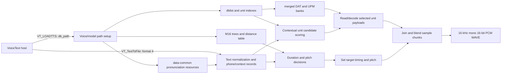

# VoiceText `vt_pau.dll` static and runtime analysis

## What was generated

Ghidra 12.1.4 decompiled all 59 public `VT_*`/`VTDTTS_*` functions into `vt_pau-exported-api.c`. A second export, `vt_pau-core-pseudocode.c`, contains the key loader, license, text-to-file, text-to-buffer, synthesis, WAVE-header, and file-writing functions. These files are C-like decompiler pseudocode, not the vendor's original source. Types, parameter names, and control flow can be wrong where the binary lacks type/debug information.

The matching `vt_jam.dll`, `vt_jul.dll`, and `vt_kat.dll` have the same executable `.text` bytes as `vt_pau.dll` from the earlier section comparison. This analysis of Paul's DLL code therefore describes the shared engine code; the small `.data` differences and external voice data distinguish the installed voice packages.

## Reconstructed path

1. `VT_LOADTTS_EXT_ENG` initializes shared DLL state and a per-voice state slot, then calls `VT_CheckLicense_ENG`. In the invalid-license branch it marks the slot unlicensed and assigns a one-entry/default database setting; the function proceeds to its normal return rather than failing the load solely because the check failed. Model/data initialization still happens through helper routines, notably `FUN_10012380` and `FUN_10012a60`.
2. `VT_TextToFile_ENG` dispatches by output selector. Selector `4` calls `FUN_1001e830`, which enters the shared worker `FUN_1001e930` with internal WAVE format code `1`.
3. `FUN_1001e930` opens an output stream, allocates/initializes a synthesis context, prepares the input text, and enters a chunk loop. `FUN_1001c990` is on the text preprocessing path; `FUN_10026ab0` and `FUN_10026870` prepare and produce successive sample blocks. State and sync bookkeeping is maintained between blocks.
4. `FUN_1001f1f0` constructs a WAVE header in the context, including the `RIFF`, `WAVE`, `fmt`, and `data` fields. For internal format code `1`, the header fields indicate PCM format 1, mono, 16,000 samples/second, and 16 bits/sample. `FUN_1001f600` updates RIFF/data sizes and writes the header fields through the same seekable writer used for the audio blocks. The default worker branch writes the generated 16-bit samples; other selector values take different conversion paths.
5. `FUN_10025500`/`FUN_100255a0` serialize sample/header fields through seek/write helpers, under a critical section. The file layer is implemented inside the DLL rather than delegated to `waveOut`; `waveOut*` imports are a separate playback path.

In short, the host's “give it text, get a WAV” behavior is a thin API call into a stateful engine. The engine parses text, looks up voice/model data, synthesizes sample chunks, and writes a finalized RIFF/WAVE PCM stream. The database files are inputs to the engine, not code recovered by Ghidra.

## What this says about a native POSIX port

The public API and the orchestration around it are now visible enough to sketch a compatible replacement interface. The difficult part remains the unnamed synthesis internals and the proprietary model database formats. Ghidra has not recovered meaningful source-level names for most internal functions, and many helpers still need call-graph and data-format analysis. Separately, the PE32 DLL depends on Windows APIs and 32-bit calling/data conventions, so its binary cannot simply be loaded as a native ELF shared library. A native implementation would need either a compatibility layer around those boundaries or a source reimplementation of the engine logic.

Voice/model assets are separate from the engine and were not modified. No conclusion about redistribution or reuse rights is implied by this technical analysis.

## Model loading and use (deeper pass)

The binary contains path templates for `data-%s/`, `dat/`, `mc_idx_tbl/`, `ttsdata/`, `tree3/`, `dict-eng/`, and `dist_tbl/`. The path builder selects the voice/model directory, then staged initialization loads the shared dictionary resources, voice trees and distance table, the database list and per-unit indexes, and finally the matching `.dat`/`.upm` pairs. The tree loader starts with a legacy `.tree2` template and changes the final version digit to `3`; that matches this package's `ttsdata/tree3/` files.

The sample package has a four-row `dblist.idx` (`gen`, `num`, `etc`, `alp`). The corresponding `mc_idx_tbl/unit-*.idx` files describe the merged unit banks. The loader reads their headers and records to build in-memory descriptors and offset tables, then opens `dat/merged-*.dat` and `dat/merged-*.upm` for each bank. The `.dat` files are used as the primary unit payload: `FUN_1002c8b0` reads a selected record span, passes it through the engine's byte-stream decoder, produces 16-bit samples, and applies an amplitude scale. The `.upm` stream is read through a parallel handle table by the unit-processing code as auxiliary per-unit data. The complete on-disk record schema is not yet recovered.

The shipped API header, `include/vt_eng.h`, provides the original call-level names that Ghidra could not infer: `VT_LOADTTS_ENG(HWND, nSpeakerID, db_path, licensefile)` and `VT_TextToFile_ENG(fmt, tts_text, filename, nSpeakerID, pitch, speed, volume, pause, dictidx, texttype)`. It explicitly defines format `4` as `VT_FILE_API_FMT_S16PCM_WAVE`. Its loader error constants also align with the observed staged loader returns: prosody/tree load `8`, unit-index load `7`, table load `6`, `.dat` load `9`, and `.upm` load `10`.

The synthesis path looks like context-dependent unit selection with concatenative waveform assembly, rather than a thin call to an operating-system TTS service. Text processing creates phone/context records; decision-tree lookups supply duration and pitch-related values; candidate search scores model units using surrounding phone features; selected unit identifiers and durations are passed to the audio path. The audio path retrieves the associated unit payloads and blends/overlaps neighboring blocks before writing samples. This reading is supported by the `.dat`/`.upm` access sites, candidate-scoring/sorting functions, decision-tree evaluators, and sample-buffer mixing routines, but the unnamed scoring feature fields and exact join algorithm still need labeling.

The bundled `cepdist.tbl` is 2,099,202 bytes. The loader reads a 16-bit count of 1,024 followed by 524,800 32-bit values (a triangular table, matching the loader's size calculation), then constructs an additional derived lookup table. It is one of the scoring resources rather than audio data.

## Binary format details recovered from the readers

### `tree3` decision trees

The decision-tree reader `FUN_100016e0` consumes a 7-byte header:

| Offset | Width | Meaning established by the reader |
| --- | ---: | --- |
| 0 | 2 | Node count, read as a signed 16-bit value |
| 2 | 1 | Output-vector width |
| 3 | 4 | Declared total number of 16-bit entries across all node lists |

Each node is a compact variable-length record. The reader expands it into a 16-byte in-memory node. On disk the fixed fields are a feature selector byte, an operation byte, a signed 16-bit threshold, a one-byte list length, that many signed 16-bit list entries, and two signed 16-bit child/leaf references. This makes the record size `9 + 2 * list_length` bytes. In memory, the list becomes a pointer; the two references occupy offsets 6 and 8, the feature and operation are at offsets 10 and 11, and the threshold is at offset 4. Operation `D` means membership in the node's list. Operation `C` compares the selected signed feature value with the threshold. Negative references terminate the walk and encode a leaf ordinal as `-reference - 1`.

After the nodes comes a little-endian 16-bit output table of `output_width * (node_count + 1)` entries. `FUN_10001670` selects the first value in the reached row; `FUN_100016a0` copies the full row. The loader checks that the sum of node-list lengths matches the 32-bit aggregate count. For example, `duration/caff.tree3` starts `30 00 01 b2 00 00 00`: 48 nodes, output width 1, and 178 total list entries. Its first node starts at offset 7 with feature 2, operation `D`, list length 14; the first two list entries are 1 and 2. These conclusions are directly supported by both the reader and sample bytes. Caller paths establish duration and pitch-related roles; the exact meaning and unit of every numeric output remain unresolved.

### `mc_idx_tbl/unit-*.idx`

The index reader accepts two layouts. `FUN_10019e80` reads a one-byte length followed by that many bytes. When the payload begins with `ver.` and matches the expected version marker, it records a versioned-header flag and the header extent; otherwise it selects the older layout. All four Paul indexes use the versioned `ver.2013\0VoiceText-Eng\0` header. Each has one bank-name entry (`merged-gen`, `merged-num`, `merged-etc`, or `merged-alp`), a zero tag byte, a 32-bit unit count, and a 16-bit per-unit block stride of 19.

For these files, the complete header and table occupy 45 bytes. `FUN_10019940` then skips `19 * unit_count` bytes and bulk-reads 21 bytes per unit into separate arrays, in this order: one byte, a 7-byte unit signature, one byte, then three groups each containing a 16-bit column and two byte columns. The 19-byte per-unit block is skipped by this loader path; its payload span fields are traced below. This predicts a total file length of `45 + 40 * unit_count` bytes. The read-only inspector at `tools/revkit/scripts/inspect_unit_idx.py` applies this layout to all four files. Each calculated length matches the actual file exactly:

| Index | Units | File size |
| --- | ---: | ---: |
| `unit-gen.idx` | 440,124 | 17,605,005 bytes |
| `unit-num.idx` | 24,508 | 980,365 bytes |
| `unit-etc.idx` | 115,723 | 4,628,965 bytes |
| `unit-alp.idx` | 119 | 4,805 bytes |

The field names above describe widths and order only. Use sites reveal more about the 7-byte unit signature: `FUN_10016ea0` maps selected bytes through lookup tables and derives a 5-byte class key; `FUN_1001a5a0` sorts/deduplicates these keys and creates unit-to-class mappings. `FUN_10016ef0` expands a 5-byte class key into one of two 10-byte feature views. `FUN_10023a70` scores key differences using weight tables. The algorithm therefore uses these fields as context-matching features, although the individual phonetic and attribute meanings are not fully identified. The older layout remains only structurally understood through `FUN_100197d0`.

### Paired `.dat` and `.upm` unit data

The primary `.dat` read path fetches a selected byte span from a bank, passes it to `FUN_10001b30`, and copies the decoded 16-bit samples into the synthesis buffer. The reader refills a 32-bit bit window from the record, scans a unary zero prefix, then reads a suffix whose width is supplied by the decoder state. `FUN_100020a0` maps the resulting integer to signed residuals by folding even values to nonnegative numbers and odd values to negative numbers. An independent peer review identifies the complete headerless stream as Shorten with 256-sample blocks, `nmean=4`, and no QLPC. That identification and the reported corpus-wide PCM parity belong to Wag's separate analysis; our direct comparison is documented below.

The decoder's mode handlers reconstruct samples from those residuals using different predictors: one adds to an initial/reference value, another adds to the previous sample, another uses `2 * previous - previous_previous`, and another combines three preceding reconstructed values. Mode 8 initializes the predictor history to zero. This is predictive waveform coding; the independent Shorten identification is externally corroborated by the exact runtime comparison below. The current evidence does not support calling it ADPCM.

The `.upm` reader is more concrete: `FUN_1002bbd0` reads a per-unit byte vector through offsets stored in the unit index, widens each byte to a 16-bit value, then shifts it left once. `FUN_1002bc60` converts adjacent vector values into cumulative segment records containing a start position, two endpoint values, and timing/unit parameters. Runtime evidence in [Stage 4](#stage-4-upm-and-index-field-semantics) shows that these values define adjacent waveform segments and affect reconstructed sample counts under a non-default pitch setting. The raw byte values are consistent with 8 kHz pitch-period lengths, doubled onto the 16 kHz sample grid; that physical interpretation remains an inference, not vendor documentation. `.upm` supplies adjustment data, while `.dat` supplies the waveform samples. The names “DAT” and “UPM” are extension labels only; no vendor format documentation was found in the inspected package.

## Stage 1: unit-to-payload span mapping

The versioned unit-index file contains a 19-byte-per-unit block immediately
after its header and before the 21-byte feature-column arrays. `FUN_10019940`
at `0x10019940` skips the block while loading feature columns. The per-unit
path `FUN_1001b0d0` at `0x1001b0d0` instead reads a 19-byte record and copies
its fields into a 24-byte descriptor. `FUN_1002c120` at `0x1002c120` then
derives the selected unit's DAT and UPM read parameters from that descriptor.

The 19-byte records have this payload span layout in all four Paul indexes.
The integer fields are little-endian:

| Record offset | Width | Field | Evidence |
| ---: | ---: | --- | --- |
| 0 | 4 | `.dat` offset | Used by the DAT reader and confirmed by runtime seeks. |
| 4 | 2 | First-side sample span | Little-endian value; cross-checked as twice the sum of the first-side UPM bytes, including the shared boundary period. |
| 6 | 2 | Second-side sample span | Little-endian value; cross-checked as twice the sum of the second-side UPM bytes, including the shared boundary period. |
| 8 | 2 | `.dat` span length | Used by the DAT reader; offset plus length reaches the next record or EOF. |
| 10 | 4 | `.upm` offset | Base offset for the unit's combined UPM span. |
| 14 | 1 | First UPM count | Used alone for the first side or in the combined span. |
| 15 | 1 | Second UPM count | Used alone for the second side or in the combined span. |
| 16 | 3 | Cached UPM edge periods | First, shared middle, and last values of the combined UPM vector. |

`FUN_1002c120` chooses one of three UPM views. For the first side, it reads
`first_count` bytes at the base offset. For the second side, it reads
`second_count` bytes at `base + first_count - 1`. For the combined view, it
reads `first_count + second_count - 1` bytes at the base offset. The two sides
share one byte. `FUN_1002bbd0` passes the selected count to `FUN_10025440`
with element size 1; `FUN_100254a0` at `0x100254a0` multiplies element size by
count for the underlying read. This explains why a record containing counts 9
and 10 causes an 18-byte read.

The read-only inspector `tools/revkit/scripts/inspect_unit_idx.py` accepts
`--data-dir data-paul/M16/dat` and checks these spans across all banks. On the
current local assets, both DAT and combined UPM spans begin at zero, meet the
next record exactly, stay in bounds, and end at their matching file's EOF.

| Bank | Units | `.dat` bytes | `.upm` bytes | DAT joins / expected | UPM joins / expected | Both end at EOF |
| --- | ---: | ---: | ---: | ---: | ---: | --- |
| `gen` | 440,124 | 346,591,252 | 5,233,535 | 440,123 / 440,123 | 440,123 / 440,123 | Yes |
| `num` | 24,508 | 21,377,616 | 326,283 | 24,507 / 24,507 | 24,507 / 24,507 | Yes |
| `etc` | 115,723 | 102,844,328 | 1,579,302 | 115,722 / 115,722 | 115,722 / 115,722 | Yes |
| `alp` | 119 | 160,620 | 2,261 | 118 / 118 | 118 / 118 | Yes |

**Runtime checkpoint A: complete for representative units.** In a disposable 32-bit Wine 9.0 container,
the console harness synthesized `Hello from the VoiceText Stage 1 runtime
check.` to an 88 KB WAV. The model files were mounted read-only. A combined
Wine API relay and `strace -yy` trace tied file handles to the paths and
captured on-demand 19-byte reads from `unit-gen.idx`, then seeks and reads from
`merged-gen.dat` and `merged-gen.upm`.

For example, the 19-byte record at index-file offset `0x006776c5` contains
DAT offset `0x10ddf37c`, DAT length `0x0310`, UPM base `0x0041a461`, and UPM
counts 7 and 7. Runtime calls read `0x0310` DAT bytes, then read 7 UPM bytes
at `0x0041a461` and another 7 at `0x0041a467`, sharing one byte. The combined
UPM span is 13 bytes, ending exactly at the next record's offset
`0x0041a46e`. The record at index offset `0x0064e7dd` has counts 9 and 10;
the DLL reads the expected combined 18-byte UPM span at `0x00402bda`. Its DAT
offset and length, `0x10757750` and `0x0434`, also match the runtime seek/read.
These runs cross-check both split and combined UPM views against raw records.

The separately supplied VoiceText working notes agree on the DAT offset and
coded-size fields, but treat only record byte 14 as the UPM length and therefore
report gaps in the UPM banks. The runtime reader also uses byte 15. Including
both counts yields exact UPM coverage in all four banks, so those reported gaps
come from an incomplete span formula. Other proposed labels in those notes,
including pitch-mark and prosody meanings, still need their own checks.

A separate `A. B. C.` runtime attempt loaded the `alp` index and payload paths
but did not cause a unit-level `merged-alp.dat` or `.upm` read. The alphabet
bank's complete span partition is therefore established structurally; this
runtime corpus only selected `gen` units.

The DLL was run under Wine for this behavior check, not under a native Windows
debugger. No model files were changed, and verification/license data was not
opened or altered. Exact candidate-feature semantics and DAT sample-value
validation remained open at the end of Stage 1; see Stage 2 below.

## Stage 2: `.dat` decoding

The standalone experimental decoder in `tools/revkit/scripts/decode_dat.py`
implements the statically recovered MSB-first unary-plus-remainder reader,
signed residual fold, control values, predictors, frame mean/history updates,
output shift, and final 16-bit sample conversion. It is a clean-room analysis
tool and does not include or modify vendor code or voice assets.

The key state and control behavior recovered from `FUN_10001b30` and its
handlers is:

| Code | Behavior |
| ---: | --- |
| 0 | Decode residuals with the mean-history offset as the predictor seed. Four frame means are kept and averaged. |
| 1 | Predict from the previous reconstructed sample. |
| 2 | Predict `2 * previous - previous_previous`. |
| 3 | Predict `3 * (previous - previous_previous) + previous_previous_previous`. |
| 4 | End this unit's coded stream. |
| 5 | Read a Rice-coded width, then read the next frame's sample count using that width. |
| 6 | Read and set the output left shift. |
| 8 | Emit a frame of zero samples. |

The initial frame length is 256 samples; residual width and output shift start
at zero, and predictor history starts at zero. Codes 0–3 each read a residual
width and then Rice-coded residual values; the even/odd fold maps `v` to `v/2`
when even and `-(v+1)/2` when odd. The control reader is MSB-first, with a
unary zero quotient terminated by one and a fixed-width remainder. At each
frame boundary the engine updates mean and three-sample history state. Output
samples are left-shifted, positive-clamped to 32767, and stored as 16-bit
values. Record extent bounds the bitstream; control code 4 ends the decoded
samples before any trailing byte padding.

The `nmean=4` profile is also visible in the DLL's mode handlers. At
`0x10001c19`, the decoder sums four 32-bit mean-history slots, applies signed
rounding, and adjusts for the active output shift before dispatching the
frame. The mode handlers shift the four-entry history and store the current
rounded, shifted frame mean. The decoder initializes this history to zero.
Predictor modes 1–3 read up to three prior samples, drawing from the current
frame and a three-sample tail saved from the prior frame. `decode_dat.py`
models both histories.

**Runtime checkpoint B: selected-sample parity observed across predictor
modes.** In one isolated Wine/GDB run, a breakpoint at `FUN_10001b30`
(`vt_pau.dll` address `0x10001b30`) captured 32 decoder calls. They correspond
to 27 unique `gen` payloads in the controlled `Hello from the VoiceText Stage
1 runtime check.` synthesis. All 32 captured PCM buffers match the standalone
decoder byte-for-byte. The set exercises predictor modes 0, 1, 2, and 3,
including repeated mode-0 frames with a four-block mean history. Mode 8 did
not occur in this corpus. The raw captures and `capture-many.gdb` are retained
under the ignored `tools/revkit/work/stage2-copy/` directory.

As a separate structural check, the decoder was run on the first, second,
middle, and last unit in each of `gen`, `num`, `etc`, and `alp`. All 16 decoded
sample counts equal twice the sum of the corresponding combined UPM period
vector, using the shared-boundary formula `first_count + second_count - 1`.
This checks stream termination and decoded lengths across banks, but does not
establish sample-value parity for those 15 other units.

Wag's peer review independently identifies the headerless mono Shorten
profile as block size 256, `nmean=4`, and no QLPC. Its report of exact PCM for
all 580,474 payloads remains external corroboration; we have not rerun the
full-corpus check in this repository.
The review also extends the index interpretation: record bytes 4 and 6 are
first- and second-half sample lengths, bytes 16–18 cache first, shared middle,
and last UPM periods, and UPM values are 8 kHz pitch-period lengths (doubled
for the 16 kHz waveform). Wag's review reports those cached periods are used
for cross-fade edge overlap. Stage 4 independently checks the byte 4/6 and
16–18 relationships across all local versioned Paul records and traces the
UPM vector through reconstruction. We have not independently established the
specific cross-fade role Wag assigns to the cached edge periods.

Stage 2 is complete for the observed 2013 Paul format and tested decoder
paths: 27 unique engine-decoded payloads match exact PCM values, and 16
cross-bank records match expected output lengths. This does not establish
full-corpus parity, runtime coverage of mode 8, support for other VoiceText
package versions, or whole-synthesis parity for other inputs and settings,
including prosody changes.

## Stage 3: decode-to-WAVE boundary check

**Stage 3 runtime checkpoint: complete for the controlled reference input.**
The 32-bit VoiceText executable and Paul data were run in the existing
isolated Wine container with the model mounts read-only and networking
disabled. The 48-byte input was
`Hello from the VoiceText Stage 1 runtime check.`. The resulting
`tools/revkit/work/stage3/reference.wav` is an 89,478-byte RIFF/WAVE
file with PCM format 1, mono, 16,000 samples/second, 16-bit samples, and 44,717
frames (2.7948125 seconds). Its SHA-256 is
`3bd8bbfde92f1d645715de40a03a6a68e3acedf0a3361158b869b8a07d803187`.

At `vt_pau.dll` address `0x10026870` (Ghidra pseudocode name
`FUN_10026870`), the runtime trace captured both calls made from the text-to-
file worker's synthesis loop. Each call received the same sample-buffer
pointer and returned to `0x1001ea93`. The returned byte counts were 57,496 and
31,938; in each call, the returned count matched the context's byte-count
field at offset `0x30`. Capturing the pointed-to bytes at each return and
concatenating them produced 89,434 bytes, exactly equal to the WAV `data`
chunk. The concatenated bytes match byte-for-byte, not just by length. The
individual captures are retained as
`tools/revkit/work/stage3/blocks/block-000.pcm` and `block-001.pcm` under the
ignored work directory.

This cross-check ties the static call sequence to the runtime output: the
worker prepares text and a WAVE header, repeatedly calls `FUN_10026870` to
produce sample buffers, and sends the returned sample extents to its file
writer. The earlier Stage 2 trace used the same input and matched 32 decoded
`.dat` outputs against the standalone decoder; this Stage 3 trace carries that
agreement through the post-decode sample boundary to the final WAVE data.
The complete WAV is also byte-identical to the prior reference run. No decoder
or synthesis mismatch was observed for this input.

The first attempt to trace this boundary with GDB's `finish` command stopped
in Wine's `RtlEnterCriticalSection` path before producing a WAV. The retained
trace instead sets a temporary breakpoint at the observed return address for
each of the two calls; that run exited normally. This was a debugger-method
issue, not a VoiceText output mismatch.

This checkpoint does not explain the semantic role of every `.upm` value,
cover other texts or synthesis settings, prove joins for every possible unit,
or establish parity across the full voice corpus. Those remain separate
roadmap work.

## Stage 4: UPM and index field semantics

**Stage 4 checkpoint C: complete for the 2013 M16 Paul versioned indexes and
selected runtime units.** Static decompilation, a read-only scan of all four
local indexes and UPM banks, and controlled Wine/GDB traces were compared.
The results independently confirm the proposed meanings of record bytes 4,
6, and 16–18. This is a structural field check, not full-corpus DAT sample
parity.

For all 580,474 local records, a one-off read-only scan found zero mismatches
for each of these relationships:

| Record field | Checked relationship | Result |
| --- | --- | --- |
| Bytes 4–5 | `2 * sum(UPM[0:left_count])` | All records matched |
| Bytes 6–7 | `2 * sum(UPM[left_count - 1:])` | All records matched |
| Byte 16 | First byte of the combined UPM vector | All records matched |
| Byte 17 | Shared boundary byte at `left_count - 1` | All records matched |
| Byte 18 | Last byte of the combined UPM vector | All records matched |

The scan also found every combined UPM span within its bank. Raw UPM values
range from 15 to 247, and a side contains at most 52 periods. These are
observed properties of the local dataset; they do not establish validity
bounds for other VoiceText versions or packages. The scan did not decode every
DAT stream or compare every decoded PCM payload with the DLL.

Two `gen` records were then followed through runtime boundaries. For record 0
(unit 0; index record offset `0x2d`), the combined vector is
`[54,53,54,53,61,57,65,66,73,62,56,53,52]`, with side counts 8 and 6.
Its byte 4 field is 926, equal to twice the first-side sum; byte 6 is 724,
equal to twice the second-side sum. Bytes 16–18 are `[54,66,52]`, matching
the first, shared, and last vector values. The record's DAT decoder output
contains 1,518 samples, equal to twice the combined UPM sum.

For record 1 (unit 1; index record offset `0x40`), the vector is
`[52,52,51,50,50,51,49,49,49,50]`, with side counts 5 and 6. Its two span
fields are 510 and 596, and its cached bytes are `[52,50,50]`. The standalone
DAT decoder produces 1,006 samples, again equal to twice the combined UPM sum.

At runtime, `FUN_1001b0d0` copied the selected record's fields into its
24-byte unit descriptor. `FUN_1002bbd0` read each selected UPM vector and
returned the raw byte values widened and multiplied by two. With the default
pitch sentinel (-1), `FUN_1002bd90` took a fast path and did not build segment
records. In a controlled run changing only pitch to 120, `FUN_1002bc60`
returned one segment per adjacent period pair: 12 records for unit 0's
13-value vector and 9 for unit 1's 10-value vector. Their start positions
were cumulative sums of the doubled vector values; each segment held the
adjacent periods as its endpoints. `FUN_1002afb0` then advanced the output
cursor by 1,474 samples for unit 0 and 917 for unit 1. For unit 0 under the
default pitch sentinel, it advanced by 1,414 samples. This confirms that the
segment/reconstruction path consumes the UPM-derived timing data and changes
per-unit output length for the selected non-default setting. It does not
establish the complete pitch algorithm, edge-overlap semantics, or how output
durations are coordinated across an entire utterance.

The ×2 conversion places UPM values on a 16 kHz sample grid in the traced
configuration. Interpreting each raw value as an 8 kHz pitch-period length is
consistent with that conversion and the interpolation path, but remains an
inference. Exact timing parameter names and the roles of fields in the
five-word segment records are not fully recovered. Supporting GDB logs,
selected buffers, and the generated decompilation report are retained under
the ignored `tools/revkit/work/stage4/` and `tools/revkit/work/reports/`
directories.

This stage covers only the 2013 M16 Paul package and the selected `gen`
runtime units. It does not explain the remaining 21-byte feature columns,
legacy index layouts, other VoiceText versions, or all-corpus decoded-sample
parity. Those remain open.

## Stage 5: `tree3` parser and caller behavior

**Stage 5 checkpoint D: complete for the 17 Paul duration and pitch trees.**
The standalone read-only parser at `tools/revkit/scripts/tree3.py` validates
all 17 files. It checks header counts, variable-length node extents, list
totals, output-table extents, and every child/leaf reference. The tree shape
is now distinguished from its input record: header byte 2 is the number of
16-bit values in each output row, while each node's feature byte selects an
entry in a caller-built input vector.

Across the 17 files, operations are `D` (membership in the node's signed
16-bit list) and `C` (compare a signed input feature with the signed
threshold). The evaluator `FUN_100015f0` chooses the first child for a `D`
match or for a `C` feature value less than or equal to the threshold; it
chooses the second child otherwise. A nonnegative reference is a node index;
a negative reference encodes leaf `-reference - 1`. The parser's table has one
output row for each node plus the final leaf, with one or twelve values per
row as shown here:

| Group | Tree | Nodes | Output width | Feature selectors | Runtime lookups |
| --- | --- | ---: | ---: | --- | ---: |
| Duration | `caff` | 48 | 1 | 0, 1, 2, 4–7 | 4 |
| Duration | `capp` | 315 | 1 | 0–2, 4–8 | 16 |
| Duration | `cfri` | 248 | 1 | 0–2, 4–8 | 31 |
| Duration | `cnas` | 352 | 1 | 0–2, 4–8 | 23 |
| Duration | `cstop` | 717 | 1 | 0–2, 4–8 | 29 |
| Duration | `vdi` | 433 | 1 | 0–7 | 20 |
| Duration | `vlong` | 369 | 1 | 0–7 | 19 |
| Duration | `vsch` | 101 | 1 | 1–7 | 2 |
| Duration | `vshort` | 812 | 1 | 0–7 | 27 |
| Pitch | `bf` | 18 | 12 | 1–3, 6, 9, 11 | 1 |
| Pitch | `bt` | 22 | 1 | 0–3, 9, 10 | 1 |
| Pitch | `nbf` | 263 | 12 | 0–11 | 58 |
| Pitch | `nbt` | 167 | 1 | 0–4, 6–10 | 58 |
| Pitch | `qbf` | 9 | 12 | 0–3, 9, 11 | 1 |
| Pitch | `qbt` | 7 | 1 | 0, 1, 9, 10 | 1 |
| Pitch | `sbf` | 42 | 12 | 0–3, 9–11 | 8 |
| Pitch | `sbt` | 26 | 1 | 0–3, 9, 10 | 8 |

The loader `FUN_10001050` maps all nine duration files into the synthesis
state and loads four pitch pairs (`bt/bf`, `nbt/nbf`, `qbt/qbf`, `sbt/sbf`).
The names and split roles are observed in the loader. The family abbreviations
do not yet have established phonetic expansions.

`FUN_10013380` performs duration lookups. For each selected phone/context
record it calls `FUN_100135d0`, which constructs nine short input values from
the current and neighboring phone classes, attributes, and boundary/position
state. A category mapping selects one of the nine duration trees, and its
single 16-bit result is written to per-phone duration metadata. This supports
the “duration” role from both the path and the consumer. The result's time
unit and how it is converted into utterance timing remain unknown.

`FUN_100138c0` performs pitch-related lookups. `FUN_10013a20` constructs the
pitch context values; a family selector chooses one scalar tree and its paired
12-value tree. The scalar result is stored as one byte in the phone record;
the 12-value row is copied as 16-bit values. `FUN_100137c0` then consumes the
12 values as two six-value groups through `FUN_10013790`. The values are used
in the pitch path, but their physical units and complete acoustic meaning are
not recovered. The input slots' exact phonetic names also remain partly
unknown; runtime captures show 12 readable short values at the lookup
boundary, and tree selectors range as high as 11.

**Runtime cross-check:** across three controlled inputs, GDB captured 307
calls to `FUN_10001670` and `FUN_100016a0`. The parser reproduced the DLL's
returned scalar values or full 12-value rows for all calls across all 17 tree
files. The original phrase was `Hello from the VoiceText Stage 1 runtime
check.` A varied phrase, `See the blue moon above the quiet house. A quick
brown fox jumps over a lazy dog. Why should a brave teacher use the new room
at noon?`, selected the previously unseen `vlong` and `vsch` trees. A second
phrase, `I see the green light. Are you going now? Why? No! We went to the zoo,
and they say the sky is blue.`, selected the remaining `bf`, `bt`, `qbf`, and
`qbt` trees. No mismatch was observed. The individual captures, generated
WAVs, and comparison helper are in the ignored `tools/revkit/work/stage5/`
and `tools/revkit/work/scripts/` directories.

Stage 5 did not analyze the shared `data-common/dict-eng` resources, expand
phone/class abbreviations, assign physical units to outputs, or trace
downstream timing and prosody decisions. Stage 6 documents the shared tree
containers and text-resource path below; voice-tree feature labels and
downstream timing/prosody questions remain open.

## Stage 6: text and pronunciation resources

### Shared resource loading and structure

`FUN_10012210` selects the shared `dict-eng` directory. Its loader maps
`engttsdict_emb`, `hashidx_emb`, and `hashcont_emb` as one family, and
`tppdict_eng`, `hashidx_eng_tpp`, and `hashcont_eng_tpp` as another. The
corresponding `hashparams` files supply the `NLP` marker, seven 32-bit
parameters, a 32-bit distribution-table length and its 32-bit entries, then a
byte-table length and that byte table. `FUN_10012030` uses those parameters in
the hash calculation; `FUN_10011820` selects a family, checks a candidate
record, and returns its associated record data. The paired index and content
files have equal entry counts, consistent with their use as parallel lookup
tables.

| Family | Parameter bytes | Distribution entries | Byte table | Index entries | Content entries |
| --- | ---: | ---: | ---: | ---: | ---: |
| Embedded | 132,132 | 256 | 131,072 bytes | 228,591 | 228,591 × 16-bit |
| TPP | 17,444 | 256 | 16,384 bytes | 31,550 | 31,550 × 16-bit |

These are file extents and entry widths, not undocumented semantics for each
parameter or record field. The resource inspector reports each dictionary
file's byte size in its JSON output.

The indexed offsets partition each lexicon file exactly. Every offset points
to a NUL-terminated key followed by a separate NUL-terminated byte payload;
the next indexed offset begins immediately after that payload. All offsets are
unique, the first is zero, and the final record ends at EOF in both families.
The embedded family has 228,591 records (key lengths 1–19 bytes; payload
lengths 2–25 bytes including the final NUL). TPP has 31,550 records (key
lengths 1–20; payload lengths 3–12). `FUN_10011820` selects the family,
computes a hash, checks the two-byte length/first-byte signature, and compares
the candidate key byte-for-byte before returning it. The two payload families
have different consumers and different grammars:

- Embedded records pass through `FUN_10003c50`, whose complete byte grammar
  is described below. Corpus inspection confirms the parser's direct-ID and
  alternative-path forms across all 228,591 records; records with none of the
  parser's low two flag bits are metadata/marker records and do not supply a
  pronunciation through this parser.
- TPP records are looked up through `FUN_1003a570` and consumed by
  `FUN_1003a7b0`. A TPP result begins with a discriminator byte and a
  NUL-terminated text/code body. Its compressed keys are transformed through
  the 256-entry u16 character map at `0x1007e388`, then greedily compressed
  with the sorted two-byte pair table at `0x10081568`. The inverse recovers
  ASCII uppercase words, place names, and hyphenated phrases. The new
  `inspect_tpp_dictionary.py` analysis script decodes and re-encodes every
  key; all 31,550 keys round-trip exactly. Across all 31,550 payloads, the
  body is one or two space-separated code atoms. The complete observed
  grammar is one
  atom of `A`–`G` followed by decimal digits, except for `AX`; the observed
  two-atom sequences are `A G`, `A A`, `B B`, and `C C`. Corpus counts by
  sequence are: `G` 18,493; `A` 7,853; `B` 3,979; `F` 829; `C` 296; `D` 19;
  `E` 2; `A G` 66; `C C` 7; `A A` 5; and `B B` 1. The `A` keys are
  single-component place names; `B`, `C`, `D`, and `E` keys are place names
  with two, three, four, and five hyphen-separated components respectively.
  Their payloads encode that component count followed by one binary digit per
  component (for example, `B201`, `C3010`, `D40000`, `E500010`). `A0` is the
  default single-component place-name form; the 25 `AX` records remain a
  special case with unknown semantics. `F` entries are hyphenated lexical
  compounds; `G` entries are the general lexical set. Some place-name keys
  also carry a second `G` code, as in `ACCORD → A0 G95`. These category
  associations are corroborated by decoded key contents and caller behavior;
  the meaning of each binary component flag and the numeric `F`/`G` suffixes
  remains unnamed (both numeric suffix families span 1–124). The corpus has
  7,924 `A`, 3,980 `B`, 303 `C`, 19 `D`,
  and 2 `E` place-name records; its 829 `F` compounds have 1–4 hyphens
  (746, 78, 4, and 1 records respectively). The two-atom records contain
  typed codes, not an extension of the embedded phone-ID schema.
  When the discriminator matches the caller's requested type, the body is
  passed to `FUN_10024b50`; that helper extracts a token up to a delimiter in
  the supplied delimiter string and advances the caller's cursor. On a type
  mismatch, `FUN_1003a7b0` uses the static discriminator mapping/search path,
  skips the two-byte mapped prefix, and submits the remaining text to the same
  extractor. Callers use the extracted result to rewrite or classify tokens.
  TPP callers include the multi-token path `FUN_1000dfc0`/`FUN_1000e160`,
  which checks up to five adjacent tokens, and the proper-name path
  `FUN_10034180`. This is a typed-text transformation family, not the
  embedded phone-ID payload format.

The lookup and consumer control flow, compressed-key transform, and raw TPP
body grammar are recovered. `inspect_tpp_dictionary.py` is a bounded analysis
tool for this package's matching DLL and TPP data. The one-byte code atoms,
component-flag meanings, and numeric `F`/`G` suffix names remain unknown, so
the recovered schema does not identify every output as a linguistic or
phonetic feature. `dict_resources.py` validates indexed record boundaries
and NUL framing; the TPP inspector additionally validates decoded keys and
payload shapes.

`FUN_10012280` loads `engbi.tree3` with the standard tree reader. It contains
531 nodes, width 1, and 3,097 list entries. The same reader accepts `poly.tree3`
(2,518 nodes) and `sbd.tree3` (120 nodes). `atmt.tree3` is a container rather
than a standalone tree: `FUN_100019d0` reads a 32-bit count of 27 and then
consumes 27 concatenated standard tree records to EOF. Those records contain
13,879 nodes in total. The tree parser now supports parsing one tree from a
larger byte buffer while retaining strict EOF checks for standalone inputs.

`FUN_10003660` also loads and parses `exceptdict`. The file has two
little-endian u32 range fields (`1`, `4`), then four category groups. Each
group stores a u32 category id, a u32 row count, then rows of u32 key length,
u32 value length, key bytes, and value bytes. The 2,891-byte file parses
exactly to EOF and contains 123 rows: 11, 89, 22, and 1 in groups 1–4.
`FUN_10003b70` binary-searches the selected group by key and returns the
paired value; `FUN_10008dc0` applies this lookup to concatenated phone/context
text and submits a match to `FUN_1000ca50`. The grouping and lookup behavior
are recovered. `FUN_1000c9c0` normalizes each surface while preserving
apostrophes and hyphens, counts one component plus one for each hyphen, and
rejects unsupported characters. `FUN_10008dc0` accumulates that component
count across adjacent rows; it is the selected category id (1–4). It joins
the corresponding normalized components with hyphens and tries an exact
compressed-key lookup. For a token marked `X`, a failed full-sequence lookup
retries after dropping its final component. The four groups therefore encode
one-, two-, three-, and four-component pronunciation exceptions. Reversing
the pair table at `0x10081568` exposes readable keys: group 1 includes
`h'expose`, `pinata`, and `toysrus`; group 2 includes `a-cappella`,
`de-facto`, and `san-francisco`; group 3 includes `a-la-mode`,
`c'est-la-vie`, and `coup-de-theatre`; group 4 contains
`je-ne-sais-quoi`. Values are compact pronunciation-code strings passed to
the phone-row writer, not replacement words. Their byte schema is known,
but the individual codes still lack phonetic labels. Nine `.txt2` files are read by
`FUN_100033e0` and its
callers: `wab`, `chc_sort`, `streeta_sort`, `streetf_sort`, `citya_sort`,
`abbrh_sort`, `abbrt_sort`, `abbrc_sort`, and `sbdw_sort`. The single-column
or paired-column mode is selected at each callsite. `FUN_10003540` splits
their body on pipe, CR, and LF delimiters and trims trailing spaces/tabs.
Each file has a 3-byte start marker, encoded body, one shift byte, ten encoded
count bytes, and the matching 3-byte end marker. `FUN_10010300` subtracts the
shift byte modulo 256 from every body and count byte. The count decodes as an
ASCII decimal number followed by NUL padding. All nine files use shift `0x0a`,
and decoded line counts match their declared counts. `dict_resources.py` now
validates the transform, row count, and callsite-selected column shape.

| Resource | Rows | Mode | Observed columns and use |
| --- | ---: | :---: | --- |
| `wab.txt2` | 113 | L | One-column word list; `FUN_1000dfc0` stores matching row index plus one in token-record byte `+0x26`. |
| `chc_sort.txt2` | 2,581 | M | Key and four-character `0`/`1` mask; `FUN_10002680` maps characters to bits `8,4,2,1` and checks that all requested bits are present. |
| `streeta_sort.txt2` | 347 | M | Uppercase street alias to canonical street name; used with `streetf_sort`. |
| `streetf_sort.txt2` | 211 | L | One-column canonical street-name list, used by address processing. |
| `citya_sort.txt2` | 117 | M | Locality alias to canonical locality string. |
| `abbrh_sort.txt2` | 55 | M | Abbreviation key and numeric tag; membership contributes bit 0 in `FUN_100526b0`. |
| `abbrt_sort.txt2` | 42 | M | Abbreviation key and numeric tag; membership contributes bit 1 in `FUN_100526b0`. |
| `abbrc_sort.txt2` | 330 | M | Abbreviation key and numeric tag; membership contributes bit 2 in `FUN_100526b0`. |
| `sbdw_sort.txt2` | 1,067 | M | Word and numeric class index; `FUN_100528b0` maps the index through a fixed code table, with character and suffix fallbacks. |

`abbrh_sort`, `abbrt_sort`, and `abbrc_sort` store ASCII tags `1` and `2`.
`FUN_10052d00` reads them: tag `1` requires an exact-case key match, while
tag `2` accepts the case-folded match. If multiple case variants compare
equal under the table's case-insensitive ordering, the helper scans adjacent
rows to select the exact-case row or the tag-`2` fallback. `FUN_100526b0`
turns membership in `abbrh_sort`, `abbrt_sort`, and `abbrc_sort` into bits
0–2 respectively. Their contents identify title/honorific forms (for
example `dr`, `mr`, `st`), organization suffixes (for example `inc`, `llc`,
`ltd`), and common abbreviations, units, month/day names, and place codes.
These resources classify tokens for later rules; they are not
abbreviation-to-word replacement lists. The full 427-row H/T/C inventory,
including original case and matching tag, is in
[abbreviation-table-inventory.md](abbreviation-table-inventory.md). Street
and locality tables contain literal replacement strings. In `sbdw_sort`, the numeric column is an index
into the u16 table at `0x10081358`, and `FUN_100528b0` returns that table value. The
complete observed mapping for indices present in the file is `8→7, 9→9,
10→6, 11→2, 13→8, 14→5, 15→5, 16→5, 18→4, 19→1, 22→1, 26→2, 27→2,
28→5, 29→5, 35→8, 36→0, 37→4, 38→4, 39→4, 40→4, 41→4, 42→4, 43→10,
44→10, 46→10`. These returned class codes are exact; their linguistic names
are not identified. `FUN_100528b0` also has character, punctuation, and suffix
fallbacks when a word is absent from the table. All decoded rows are ASCII
and can be inspected with `dict_resources.py --show-rows`.

### Static text path

`FUN_1001c990` prepares text state and invokes `FUN_1001ce10`, followed by
`FUN_1001d370` and `FUN_1001d5d0`. The latter scans text against the VTML/SSML
handler table at `0x1007e888` through `FUN_1002e990`; the table contains 31
literal tag prefixes and dispatches handlers for break, emotion, mark,
part-of-speech, phoneme, pitch, say-as, skip, speed, substitution, and volume
forms. The three controlled plain-text inputs produced zero handled tag
matches. This table is markup dispatch, not the ordinary-word pronunciation
dictionary.

Two string-lookup wrappers feed `FUN_10011820`: `FUN_10003a70` selects the
embedded family and `FUN_1003a570` selects the TPP family. `FUN_10003a70`
provides phone/code alternatives for `FUN_10003c50`; `FUN_1003a570` prepares
plain keys or, for selector `E`, converts supported digraphs through the
pair table at `0x10081568` before TPP lookup. Embedded lookup is used in the
pronunciation and token-rule helpers, including `FUN_1000c040` and
`FUN_1000c3a0`. TPP lookup is used by multi-token/name transformation
callers. Neither family is a literal `.txt2` abbreviation replacement list.
`FUN_1001d370` separately maps two-byte input sequences. The generic lookup
and consumer paths are mapped; the complete linguistic interpretation of all
lexical records is still data-dependent and is not inferred from the table
membership sets alone.

### Recovered dictionary and phone/context record layouts

`FUN_10003c50` parses a dictionary payload into a bounded working record:

| Offset | Width | Recovered content |
| --- | ---: | --- |
| `0x00` | 1 byte | Result type: `E` for payload flag bit 2; `A` for bit 3 (takes precedence if both are set). |
| `0x01` | 1 byte | Not assigned by the parser. |
| `0x02`, `0x04`, `0x06`, `0x08` | 4 × u16 | Boolean fields set to 1 from payload bits 6, 4, 5, and 7; higher-level names unknown. |
| `0x0c` | u32 | Parsed pronunciation alternative/path count. |
| `0x10` | 5 × 65 bytes | Five fixed-width NUL-terminated pronunciation text slots. |
| `0x155` | 103 bytes | Alternative path/control records, using 20-byte strides and `0xff` terminators. |

Payload bit 0 selects the direct-ID form: bytes after the flag are
phone-symbol IDs terminated by NUL; each ID expands through the shared
five-byte table, and the parser records one alternative. This branch takes
precedence if bits 0 and 1 are both set. Otherwise, bit 1 selects a repeated
alternative form. Each alternative has a path/control byte sequence, ASCII
`|`, then a phone-symbol ID sequence. The path/control bytes are stored after
subtracting one and end with `0xff`; the phone sequence ends at `0xff` (or the
record's final NUL). `0xff` separates alternatives. Each phone ID expands
through the same table into that alternative's fixed-width text slot. The
parser's local buffers bound this to five alternatives. Bits 2–7 independently
set the result type and four Boolean metadata words listed above. This
recovers the full byte grammar and field widths; the compact symbol codebook
has exact numeric values but its phonetic labels remain unidentified.

Dictionary path bytes that act as symbol IDs are expanded through five-byte
slots in the runtime table initialized by `FUN_1000ebc0` at `0x100fe900`.
The parser appends each slot's NUL-terminated compact-symbol sequence to its
65-byte alternative buffer. The complete 256-slot ID-to-byte mapping is
listed in the [compact phone-symbol table](phone-symbol-codebook.md); 254
slots have assigned output bytes. The compact symbols still lack phonetic
labels.

`FUN_1000d450` writes a token-result record at a `0x554`-byte stride. Offsets
below are relative to its first argument:

| Offset | Width | Recovered content |
| --- | ---: | --- |
| `0x00` | u16 | Number of pronunciation alternatives copied to this record. |
| `0x02` | u16 | Source token index. |
| `0x04` | 1 byte | Dictionary result type (`E`, `A`, or zero). |
| `0x05` | variable | NUL-terminated source or normalized token surface. |
| `0x23` | 1 byte per path chunk | Alternative-boundary/control markers; `0xff` terminates and `0x64` separates chunks. |
| `0x37` | Up to 5 × 65 bytes | NUL-terminated model-coded pronunciation slots at `0x41`-byte strides. |
| `0x54c`–`0x552` | 4 × u16 | Dictionary metadata copied from `FUN_10003c50` offsets `0x02`–`0x08`. |

The control-marker area before the pronunciation slots is 20 bytes wide. The
`0x17c`–`0x54b` portion of the `0x554`-byte stride is not written by
`FUN_1000d450`. The builder has one caller, `FUN_1000d190`; the next converter
`FUN_1000ea20` reads the count, source index, status, surface,
first/selected-pronunciation slot, marker, and four trailing metadata words.
The context-rule pipeline then uses the converted `0x70`-byte rows. No field
reader or writer for this gap was found in the builder-to-context call path.
It is therefore documented as an unreferenced stride region in this path,
not as a field or vendor-declared padding. The gap's purpose outside this
path is unknown.

`FUN_1000d190` reads token pieces from upstream `0x94`-byte records: source
surface at `+0x34`, context form at `+0x52`, and a character/class byte at
`+0x24`.

`FUN_1000ea20` converts token-result records into a counted array of
`0x70`-byte phone/context rows. The array has a u16 count at offset `0x00`,
two alignment bytes, then rows beginning at offset `0x04`:

| Row offset | Width | Recovered content |
| --- | ---: | --- |
| `0x00` | u16 | Rule/processing flags; later rules set bits `0x01`, `0x08`, and `0x40`. |
| `0x02` | u16 | Source token index. |
| `0x04`–`0x05` | 2 bytes | Not written by `FUN_1000ea20`; no read was identified in the traced text/context path. |
| `0x06` | 1 byte | Copied token class/status byte. |
| `0x07` | Up to 30 bytes | NUL-terminated surface consumed by the text-rule pipeline. |
| `0x25` | Up to 65 bytes | Pronunciation/context-code buffer; initially copied from the first alternative or selected through context scoring. |
| `0x66` | 1 byte | Source marker: `X` when the upstream record has class `X`, otherwise ASCII `0`. |
| `0x67` | 1 byte | Not written by `FUN_1000ea20`; no read was identified in the traced text/context path. |
| `0x68`–`0x6e` | 4 × u16 | Dictionary metadata copied from token-result offsets `0x54c`–`0x552`. |

For one alternative the converter copies it directly. For several,
`FUN_100068b0` builds surrounding-phone features, evaluates a shared tree,
scores candidates, and copies the selected one. `FUN_10007520` then updates
the surface/code and flags through its normalization rule cascade. These
layouts and copy paths are recovered; names for all rule flags, code values,
and metadata words are not.

### Runtime cross-check

Isolated Wine/GDB runs exercised ordinary words, numeric boundaries, dates,
times, signs, currency, percentages, address abbreviations, and a phone-like
digit group. Captured token surfaces establish these cases:

| Input form | Captured token surfaces |
| --- | --- |
| `0`, `7`, `12`, `42`, `99` | `zero`; `seven`; `twelve`; `forty two`; `ninety nine` |
| `100`, `105`, `1000`, `999999` | `one hundred`; `one hundred five`; `one thousand`; `nine hundred ninety nine thousand nine hundred ninety nine` |
| `1234`, `2024` | `twelve thirty four`; `twenty twenty four` |
| `1000`, `1001`, `1010`, `1100`, `1900`, `1999` | `one thousand`; `one thousand one`; `ten ten`; `eleven hundred`; `nineteen hundred`; `nineteen ninety nine` |
| `2000`, `2001`, `2005`, `2010`, `2099`, `2100`, `9999` | `two thousand`; `two thousand one`; `two thousand five`; `twenty ten`; `twenty ninety nine`; `twenty one hundred`; `ninety nine ninety nine` |
| `1009`, `1099`, `1899`, `2009`, `2011`, `2101` | `one thousand nine`; `ten ninety nine`; `eighteen ninety nine`; `two thousand nine`; `twenty eleven`; `twenty one oh one` |
| `999999999999`, `1000000000000`, `999999999999999`, `1000000000000000` | Correct groups through `nine hundred ninety nine trillion nine hundred ninety nine billion nine hundred ninety nine million nine hundred ninety nine thousand nine hundred ninety nine`; `one trillion`; full groups through `999 trillion`; digitwise `one` plus fifteen `oh` tokens |
| `007` | `oh oh seven` |
| `3.14`, `12.05`, `.5`, `1,000.00` | `three point one four`; `twelve point zero five`; `point five`; `one thousand point zero zero` |
| `01/02/2024` | `January second twenty twenty four` |
| `3:45 PM` | `three forty five PM` |
| `555-1234` | `five five five one two three four` |
| `-12.5`, `+7`, `$5.00`, `25%` | `minus twelve point five`; `plus seven`; `five dollars`; `twenty five percent` |

The helpers divide the cases by syntax. In ordinary (`L`) mode,
`FUN_1005fa60` and its recursion spell ones/teens, tens plus units, hundreds,
and recursive thousand, million, billion, and trillion groups; they do not
insert “and”. `FUN_10061450` removes grouping punctuation before converting
the integer part. Integer strings of up to 15 digits use magnitude grouping
through trillions; at 16 or more digits it switches to digit-by-digit
spelling. Runtime confirmed this fallback for `1,000,000,000,000,000`: the
leading one is followed by fifteen `oh` tokens. The
direct helper returns an empty buffer for zero, and the surrounding
normalizer supplies “zero” for standalone zero. Its ordinary `L` helper
accepts values through 999,999,999. Larger groups use mode `H` for the leading
group and `L` for the remaining three-digit groups. Runtime captured correct
grouping through 999,999,999,999,999, including billion and trillion forms.

`FUN_10060fc0` spells digits individually when the grammar selects a digit
string. Leading-zero groups use “oh” (`007` → “oh oh seven”).
`FUN_10060e50` splits on a decimal point and inserts “point”; it selects
digitwise spelling for a component beginning with zero (`12.05` → “twelve
point zero five”, `.5` → “point five”). `FUN_10060fc0` calls the year helper
only for a four-digit all-numeric string whose first digit is nonzero, so a
three-digit value such as `999` stays in the ordinary numeric path and `0999`
is digitwise. For the year helper's four-digit range, a zero hundreds digit
and a final two-digit value below 10 select ordinary cardinal form. If the
last two digits are `00` and the hundreds digit is nonzero, the helper says
`(year / 100)` as a cardinal plus “hundred”. All other cases say `(year / 100)`
as a cardinal, followed by the last two digits; a one-digit remainder is
spoken as “oh” plus that digit. Runtime confirms `1010` → “ten ten”,
`1099` → “ten ninety nine”, `1900` → “nineteen hundred”, `2009` → “two
thousand nine”, `2101` → “twenty one oh one”, and `9999` → “ninety nine
ninety nine”. Slash dates use month/day/year in the captured cases and
ordinal day words (`01/02/2024` → “January second twenty twenty four”).
`FUN_10061450` and its callers add the observed sign, currency, percent, time,
telephone, and punctuation behavior.

`FUN_10061450` also has a dedicated ordinal path. It recognizes a terminal
`st`, `nd`, `rd`, or `th`, removes that suffix, converts the remaining digits,
then selects an ordinal form through `FUN_10060380`; captured date processing
uses the same ordinal path for the day component. The implementation keeps
special `zeroth` handling and suffix-sensitive lookup tables, so a generic
“append `th`” rule would be inaccurate. For dates, the observed slash form is
month/day/year, with the month named and the day ordinalized. Dates with
other separators or field order have not been validated. Signs, currency,
percent, time, and telephone forms each have separate callers/branches; their
observed examples above should not be generalized to every punctuation
pattern without another boundary probe.

Runtime abbreviation examples show the context rules are material: `Dr. Paul`
and `Dr Paul` both yield `doctor`; `dr` can yield `Drive` in an address
context. `St. Paul` yields `Saint`, while `Main St.`
yields `Street`; `Apt. 4` yields `Apartment`, while `Apt 4` remains `Apt`;
`5 p.m.` and `5 pm.` yield `five PM`; `Mr.` yields `mister`, while the
unabbreviated `Mister` stays `Mister`.

The exact expansion mechanism recovered from the tables and call chain is:

1. `abbrh_sort`, `abbrt_sort`, and `abbrc_sort` perform case-sensitive or
   case-folded membership lookup according to each row's `1`/`2` tag. Their
   match results set H/T/C bits on the token. The 427 keys, original cases,
   and tags are listed in [abbreviation-table-inventory.md](abbreviation-table-inventory.md).
   They do not contain spoken replacements.
2. Street and locality alias rows are literal substitutions: the matched
   alias maps to the canonical string in `streeta_sort` or `citya_sort`;
   canonical street names are checked against `streetf_sort`. `chc_sort`
   tests requested character-class bits. `wab` assigns a one-based class
   index. `sbdw_sort` maps words to the recovered numeric class described
   above. These are classification/address operations, not general
   abbreviation expansion.
3. For phone/context construction, `FUN_10007520` processes each token in a
   fixed cascade. Under its entry conditions it first tries the
   one-to-four-component `exceptdict` match (`FUN_10008dc0`); then applies
   token/class and embedded-dictionary checks; if no rule succeeds, its
   ordered fallback helpers are `FUN_10009dc0`, `FUN_1000a140`,
   `FUN_1000b4d0`, `FUN_1000c040`, `FUN_1000b800`, `FUN_1000c3a0`, and
   `FUN_1000c710`, followed by a final embedded lookup (`FUN_10002f10`).
   Successful rules may replace the surface-derived pronunciation code,
   change the rule/status byte, or set processing bits; they do not all
   rewrite the visible token text.
4. Before phone construction, TPP lookups apply typed codes to single-token
   or adjacent-token/name contexts. `FUN_1000e160` searches up to five
   neighboring tokens for a multi-token match, while `FUN_10034180` handles
   short name sequences. The TPP record supplies a typed code sequence; the
   caller and formatter decide which piece is applied. The code letters are
   not named yet, so the complete decision flow and raw record schema are
   known, but we cannot safely rename the code values as linguistic rules.
5. Embedded pronunciation records provide up to five alternatives in the
   phone-symbol alphabet. Multiple alternatives are selected by contextual
   feature scoring (`FUN_100068b0`); the actual phone-symbol labels and some
   context-feature names remain unresolved.

This is the recovered rule order and data flow; it explains why no single
`abbreviation → spoken words` mapping exists for the H/T/C tables. Runtime
examples validate key context choices. The code-level cascade is mapped, but
an output matrix for every table key in every context has not been captured,
and the TPP code letters still lack names. Those limits concern the corpus's
linguistic interpretation, not the `.txt2` table shapes or phone-record byte
grammar.

Three earlier isolated Wine/GDB runs captured 86, 219, and 179 scalar/vector
decision-tree lookups respectively. The
feature vectors supplied to the runtime tree evaluators and the returned
scalar values or complete vectors were compared against all local shared
dictionary trees, all 27 `atmt` subtrees, and all 17 Paul voice trees. The
comparator found a unique exact resource match for all 484 lookups: 33 to
`engbi`, 2 to `poly`, 2 to `sbd`, 145 to 26 distinct `atmt` subtrees, and 302
to Paul voice trees. There were no unmatched or ambiguous results. This
cross-check verifies tree traversal and the captured outputs. The new
record-level captures show the text and phone/context records before tree
calls. They do not identify the model-coded pronunciation symbols or every
tree feature's phonetic meaning.

All runs exited normally and produced mono 16 kHz, 16-bit PCM WAVE files:

| Input | WAVE bytes | Frames | Duration |
| --- | ---: | ---: | ---: |
| Ordinary sentence | 86,158 | 43,057 | 2.691 s |
| Time, decimal, and units | 217,246 | 108,601 | 6.788 s |
| Abbreviations and number-like strings | 233,422 | 116,689 | 7.293 s |

The Stage 5 runtime input and output files were restored from in-run copies
after each probe. Debugger traces, probe inputs, and generated WAVE files
remain in the ignored
`tools/revkit/work/stage5/probes/stage6/` directory. Run the parsers and
comparator using the commands in [the revkit README](../../tools/revkit/README.md).

### Stage 6 residual semantic questions

- Identify the compact pronunciation-byte names, four dictionary metadata
  words, and context-rule flag meanings. The full numeric phone-ID table is in
  [phone-symbol-codebook.md](phone-symbol-codebook.md).
- Check for readers of token-result stride bytes `0x17c`–`0x54b` outside the
  traced builder-to-context path; none were found in that path.
- Assign linguistic names to TPP code atoms `A`–`G` and explain the `AX`
  marker using additional caller/data evidence; the complete observed raw
  payload grammar and consumer paths are now documented above.
- Extend runtime abbreviation probes beyond representative cases if a
  per-key/context output matrix is needed. The complete H/T/C key inventory
  and matching rules are documented in
  [abbreviation-table-inventory.md](abbreviation-table-inventory.md); the
  tables themselves do not encode spoken replacements.
- Label the remaining shared-tree features and outputs; runtime equality
  currently verifies numeric tree evaluation only.

## Limits of this pass

- Analysis combines static decompilation with controlled Wine runtime traces; the DLL was not executed in a native Windows environment or under a source-level debugger.
- The `.txt2` transform, all nine row shapes and callsite uses, `exceptdict`
  framing, indexed hash-record framing, embedded phone-payload grammar, TPP
  typed-code grammar, live token-result fields, and phone/context row layout
  are mapped at the byte-offset and callsite level. The token-result stride
  gap is unreferenced in the traced producer/consumer path. Compact
  pronunciation labels, TPP code meanings, some internal field meanings, and
  per-key abbreviation context outputs remain unresolved. Cardinal number,
  decimal, ordinal, and four-digit year branches are mapped and boundary
  probed; other sign/currency/percent/time/telephone recognizers have
  representative outputs but not a complete punctuation/context matrix.
  Longer integer strings select digitwise spelling. Prosody and synthesis
  helpers are still only partly explained.
- The versioned `.idx` span layout and the sample-span/cache relationships in bytes 4–7 and 16–18 are cross-checked for all local 2013 Paul records; selected UPM timing effects are observed at runtime. The 17 Paul duration/pitch trees pass structural parsing and runtime output comparisons. Several feature columns and legacy `.idx` files still need investigation, as does full-corpus PCM parity. This is not a compatible engine replacement.
- The exact host-to-DLL argument semantics are not fully named; recovered prototypes still have `param_N` placeholders.
- This pass did not inspect `verify/verification.txt` contents or attempt to bypass the license check.
