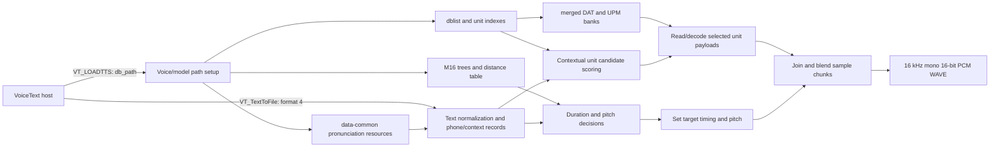

# VoiceText `vt_pau.dll` static analysis

## What was generated

Ghidra 12.1.4 decompiled all 59 public `VT_*`/`VTDTTS_*` functions into `vt_pau-exported-api.c`. A second export, `vt_pau-core-pseudocode.c`, contains the key loader, license, text-to-file, text-to-buffer, synthesis, WAVE-header, and file-writing functions. These files are C-like decompiler pseudocode, not the vendor's original source. Types, parameter names, and control flow can be wrong where the binary lacks type/debug information.

The matching `vt_jam.dll`, `vt_jul.dll`, and `vt_kat.dll` have the same executable `.text` bytes as `vt_pau.dll` from the earlier section comparison. This analysis of Paul's DLL code therefore describes the shared engine code; the small `.data` differences and external voice data distinguish the installed voice packages.

## Reconstructed path

1. `VT_LOADTTS_EXT_ENG` initializes shared DLL state and a per-voice state slot, then calls `VT_CheckLicense_ENG`. In the invalid-license branch it marks the slot unlicensed and assigns a one-entry/default database setting; the function proceeds to its normal return rather than failing the load solely because the check failed. Model/data initialization still happens through helper routines, notably `FUN_10012380` and `FUN_10012a60`.
2. `VT_TextToFile_ENG` dispatches by output selector. Selector `4` calls `FUN_1001e830`, which enters the shared worker `FUN_1001e930` with internal WAVE format code `1`.
3. `FUN_1001e930` opens an output stream, allocates/initializes a synthesis context, prepares the input text, and enters a chunk loop. `FUN_1001c990` is on the text preprocessing path; `FUN_10026ab0` and `FUN_10026870` prepare and produce successive sample blocks. State and sync bookkeeping is maintained between blocks.
4. `FUN_1001f1f0` constructs a WAVE header in the context, including the `RIFF`, `WAVE`, `fmt`, and `data` fields. For internal format code `1`, the header fields indicate PCM format 1, mono, 16,000 samples/second, and 16 bits/sample. `FUN_1001f600` updates RIFF/data sizes and writes the header fields through the same seekable writer used for the audio blocks. The default worker branch writes the generated 16-bit samples; other selector values take different conversion paths.
5. `FUN_10025500`/`FUN_100255a0` serialize sample/header fields through seek/write helpers, under a critical section. The file layer is implemented inside the DLL rather than delegated to `waveOut`; `waveOut*` imports are a separate playback path.

In short, the host's “give it text, get a WAV” behavior is a thin API call into a stateful engine. The engine parses text, looks up voice/model data, synthesizes sample chunks, and writes a finalized RIFF/WAVE PCM stream. The database files are inputs to the engine, not code recovered by Ghidra.

## What this says about a native POSIX port

The public API and the orchestration around it are now visible enough to sketch a compatible replacement interface. The difficult part remains the unnamed synthesis internals and the proprietary model database formats. Ghidra has not recovered meaningful source-level names for most internal functions, and many helpers still need call-graph and data-format analysis. Separately, the PE32 DLL depends on Windows APIs and 32-bit calling/data conventions, so its binary cannot simply be loaded as a native ELF shared library. A native implementation would need either a compatibility layer around those boundaries or a source reimplementation of the engine logic.

Voice/model assets are separate from the engine and were not modified. No conclusion about redistribution or reuse rights is implied by this technical analysis.

## Model loading and use (deeper pass)

The binary contains path templates for `data-%s/`, `dat/`, `mc_idx_tbl/`, `ttsdata/`, `tree3/`, `dict-eng/`, and `dist_tbl/`. The path builder selects the voice/model directory, then staged initialization loads the shared dictionary resources, voice trees and distance table, the database list and per-unit indexes, and finally the matching `.dat`/`.upm` pairs. The tree loader starts with a legacy `.tree2` template and changes the final version digit to `3`; that matches this package's `ttsdata/tree3/` files.

The sample package has a four-row `dblist.idx` (`gen`, `num`, `etc`, `alp`). The corresponding `mc_idx_tbl/unit-*.idx` files describe the merged unit banks. The loader reads their headers and records to build in-memory descriptors and offset tables, then opens `dat/merged-*.dat` and `dat/merged-*.upm` for each bank. The `.dat` files are used as the primary unit payload: `FUN_1002c8b0` reads a selected record span, passes it through the engine's byte-stream decoder, produces 16-bit samples, and applies an amplitude scale. The `.upm` stream is read through a parallel handle table by the unit-processing code as auxiliary per-unit data. The complete on-disk record schema is not yet recovered.

The shipped API header, `include/vt_eng.h`, provides the original call-level names that Ghidra could not infer: `VT_LOADTTS_ENG(HWND, nSpeakerID, db_path, licensefile)` and `VT_TextToFile_ENG(fmt, tts_text, filename, nSpeakerID, pitch, speed, volume, pause, dictidx, texttype)`. It explicitly defines format `4` as `VT_FILE_API_FMT_S16PCM_WAVE`. Its loader error constants also align with the observed staged loader returns: prosody/tree load `8`, unit-index load `7`, table load `6`, `.dat` load `9`, and `.upm` load `10`.

The synthesis path looks like context-dependent unit selection with concatenative waveform assembly, rather than a thin call to an operating-system TTS service. Text processing creates phone/context records; decision-tree lookups supply duration and pitch-related values; candidate search scores model units using surrounding phone features; selected unit identifiers and durations are passed to the audio path. The audio path retrieves the associated unit payloads and blends/overlaps neighboring blocks before writing samples. This reading is supported by the `.dat`/`.upm` access sites, candidate-scoring/sorting functions, decision-tree evaluators, and sample-buffer mixing routines, but the unnamed scoring feature fields and exact join algorithm still need labeling.

The bundled `cepdist.tbl` is 2,099,202 bytes. The loader reads a 16-bit count of 1,024 followed by 524,800 32-bit values (a triangular table, matching the loader's size calculation), then constructs an additional derived lookup table. It is one of the scoring resources rather than audio data.

## Binary format details recovered from the readers

### `tree3` decision trees

The decision-tree reader `FUN_100016e0` consumes a 7-byte header:

| Offset | Width | Meaning established by the reader |
| --- | ---: | --- |
| 0 | 2 | Node count, read as a signed 16-bit value |
| 2 | 1 | Feature-vector width |
| 3 | 4 | Declared total number of 16-bit entries across all node lists |

Each node is a compact variable-length record. The reader expands it into a 16-byte in-memory node. On disk the fixed fields are a feature selector byte, an operation byte, a 16-bit threshold, a one-byte list length, that many 16-bit list entries, and two 16-bit child/leaf references. This makes the record size `9 + 2 * list_length` bytes. In memory, the list becomes a pointer; the two references occupy offsets 6 and 8, the feature and operation are at offsets 10 and 11, and the threshold is at offset 4. Operation `D` means membership in the node's 16-bit list; the other observed path compares the feature value against the threshold. Negative references terminate the walk and encode a leaf ordinal as `-reference - 1`.

After the nodes comes a little-endian 16-bit output table of `feature_width * (node_count + 1)` entries. The loader checks that the sum of node-list lengths matches the 32-bit aggregate count. For example, `duration/caff.tree3` starts `30 00 01 b2 00 00 00`: 48 nodes, width 1, and 178 total list entries. Its first node starts at offset 7 with feature 2, operation `D`, list length 14; the first two list entries are 1 and 2. These conclusions are directly supported by both the parser's reads and the sample bytes. The decision-tree outputs are numeric feature vectors; their higher-level labels (duration, pitch, etc.) come from the calling code and filenames.

### `mc_idx_tbl/unit-*.idx`

The index reader accepts two layouts. `FUN_10019e80` reads a one-byte length followed by that many bytes. When the payload begins with `ver.` and matches the expected version marker, it records a versioned-header flag and the header extent; otherwise it selects the older layout. The Paul sample's `unit-gen.idx` and `unit-etc.idx` both begin with length `0x17` and the NUL-separated bytes `ver.2013\0VoiceText-Eng\0`, followed by a small table of bank/name strings and a 32-bit unit count. The initial values visible in `unit-gen.idx` include the name `merged-gen` and count `0x0006b73c` (440,124); `unit-etc.idx` names `merged-etc` and declares `0x0001c40b` (115,723).

The common header parser reads the bank-name table and declared unit count. The old-layout reader `FUN_100197d0` then walks fixed-stride records and scatters fields into separate arrays: a 7-byte key, one-byte attributes, another one-byte attribute, and three feature groups with a 16-bit value plus two byte-sized values per unit. The versioned reader `FUN_10019940` instead skips a declared fixed-size per-unit block and bulk-reads those same-width columns as arrays. This establishes the old-vs-versioned loading strategy and the broad storage shape, but not the semantic names of those columns or every header field. `FUN_1001a5a0` sorts/deduplicates each unit's 5-byte key and builds reverse mappings; `FUN_1001a8c0` and `FUN_1001aa90` validate the companion class-index and class-key files against the declared unit count.

The `.idx` files are therefore structured binary indexes rather than text tables. The strings in their headers describe the bank identity; unit selection later uses the parsed key and feature arrays to locate and rank candidates. More work is needed to name the individual byte/word columns and map their values to the candidate-scoring features.

### Paired `.dat` and `.upm` unit data

The primary `.dat` read path fetches a selected byte span from a bank, passes it to `FUN_10001b30`, and copies the decoded 16-bit samples into the synthesis buffer. The reader refills a 32-bit bit window from the record, scans a unary zero prefix, then reads a suffix whose width is supplied by the decoder state. `FUN_100020a0` maps the resulting integer to signed residuals by folding even values to nonnegative numbers and odd values to negative numbers. That is a variable-length signed-residual code; the static evidence does not establish that it is a standard named code.

The decoder's mode handlers reconstruct samples from those residuals using different predictors: one adds to an initial/reference value, another adds to the previous sample, another uses `2 * previous - previous_previous`, and another combines three preceding reconstructed values. Mode 8 initializes the predictor history to zero. This strongly suggests a proprietary predictive waveform codec with variable-length residuals. It is not enough to identify a standard codec, and the reconstruction arithmetic should be checked against real decoded payloads before writing a compatible decoder. The current evidence does not support calling it ADPCM.

The `.upm` reader is more concrete: `FUN_1002bbd0` reads the unit's auxiliary byte-vector through offsets stored in the unit index, widens each byte to a 16-bit value, then shifts it left once. The consumer uses that vector as per-unit metadata in a later interpolation/calculation path. It is not the primary waveform; `.dat` supplies the waveform samples. The names “DAT” and “UPM” are extension labels only; no vendor format documentation was found in the inspected package.

These are static-reader findings. No model files were changed, the DLL was not run under a debugger, and the verification/license data was not opened or altered. Exact candidate-feature semantics and validation of the `.dat` reconstruction against sample payloads remain open.

## Limits of this pass

- Static analysis only; the DLL was not executed under tracing or emulation during this pass.
- The large model-loading, pronunciation, prosody, and synthesis helpers remain only partly explained.
- The `.idx` structure is only partly specified; `.upm` use is better understood than its producer-side schema, and `.dat` mode-specific decode equations remain unknown. This is not yet a clean-room parser.
- The exact host-to-DLL argument semantics are not fully named; recovered prototypes still have `param_N` placeholders.
- This pass did not inspect `verify/verification.txt` contents or attempt to bypass the license check.
