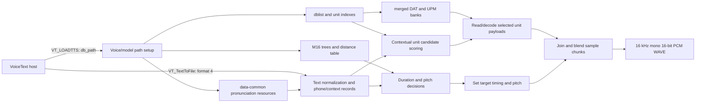

# VoiceText `vt_pau.dll` static and runtime analysis

## What was generated

Ghidra 12.1.4 decompiled all 59 public `VT_*`/`VTDTTS_*` functions into `vt_pau-exported-api.c`. A second export, `vt_pau-core-pseudocode.c`, contains the key loader, license, text-to-file, text-to-buffer, synthesis, WAVE-header, and file-writing functions. These files are C-like decompiler pseudocode, not the vendor's original source. Types, parameter names, and control flow can be wrong where the binary lacks type/debug information.

The matching `vt_jam.dll`, `vt_jul.dll`, and `vt_kat.dll` have the same executable `.text` bytes as `vt_pau.dll` from the earlier section comparison. This analysis of Paul's DLL code therefore describes the shared engine code; the small `.data` differences and external voice data distinguish the installed voice packages.

## Reconstructed path

1. `VT_LOADTTS_EXT_ENG` initializes shared DLL state and a per-voice state slot, then calls `VT_CheckLicense_ENG`. In the invalid-license branch it marks the slot unlicensed and assigns a one-entry/default database setting; the function proceeds to its normal return rather than failing the load solely because the check failed. Model/data initialization still happens through helper routines, notably `FUN_10012380` and `FUN_10012a60`.
2. `VT_TextToFile_ENG` dispatches by output selector. Selector `4` calls `FUN_1001e830`, which enters the shared worker `FUN_1001e930` with internal WAVE format code `1`.
3. `FUN_1001e930` opens an output stream, allocates/initializes a synthesis context, prepares the input text, and enters a chunk loop. `FUN_1001c990` is on the text preprocessing path; `FUN_10026ab0` and `FUN_10026870` prepare and produce successive sample blocks. State and sync bookkeeping is maintained between blocks.
4. `FUN_1001f1f0` constructs a WAVE header in the context, including the `RIFF`, `WAVE`, `fmt`, and `data` fields. For internal format code `1`, the header fields indicate PCM format 1, mono, 16,000 samples/second, and 16 bits/sample. `FUN_1001f600` updates RIFF/data sizes and writes the header fields through the same seekable writer used for the audio blocks. The default worker branch writes the generated 16-bit samples; other selector values take different conversion paths.
5. `FUN_10025500`/`FUN_100255a0` serialize sample/header fields through seek/write helpers, under a critical section. The file layer is implemented inside the DLL rather than delegated to `waveOut`; `waveOut*` imports are a separate playback path.

In short, the host's “give it text, get a WAV” behavior is a thin API call into a stateful engine. The engine parses text, looks up voice/model data, synthesizes sample chunks, and writes a finalized RIFF/WAVE PCM stream. The database files are inputs to the engine, not code recovered by Ghidra.

## What this says about a native POSIX port

The public API and the orchestration around it are now visible enough to sketch a compatible replacement interface. The difficult part remains the unnamed synthesis internals and the proprietary model database formats. Ghidra has not recovered meaningful source-level names for most internal functions, and many helpers still need call-graph and data-format analysis. Separately, the PE32 DLL depends on Windows APIs and 32-bit calling/data conventions, so its binary cannot simply be loaded as a native ELF shared library. A native implementation would need either a compatibility layer around those boundaries or a source reimplementation of the engine logic.

Voice/model assets are separate from the engine and were not modified. No conclusion about redistribution or reuse rights is implied by this technical analysis.

## Model loading and use (deeper pass)

The binary contains path templates for `data-%s/`, `dat/`, `mc_idx_tbl/`, `ttsdata/`, `tree3/`, `dict-eng/`, and `dist_tbl/`. The path builder selects the voice/model directory, then staged initialization loads the shared dictionary resources, voice trees and distance table, the database list and per-unit indexes, and finally the matching `.dat`/`.upm` pairs. The tree loader starts with a legacy `.tree2` template and changes the final version digit to `3`; that matches this package's `ttsdata/tree3/` files.

The sample package has a four-row `dblist.idx` (`gen`, `num`, `etc`, `alp`). The corresponding `mc_idx_tbl/unit-*.idx` files describe the merged unit banks. The loader reads their headers and records to build in-memory descriptors and offset tables, then opens `dat/merged-*.dat` and `dat/merged-*.upm` for each bank. The `.dat` files are used as the primary unit payload: `FUN_1002c8b0` reads a selected record span, passes it through the engine's byte-stream decoder, produces 16-bit samples, and applies an amplitude scale. The `.upm` stream is read through a parallel handle table by the unit-processing code as auxiliary per-unit data. The complete on-disk record schema is not yet recovered.

The shipped API header, `include/vt_eng.h`, provides the original call-level names that Ghidra could not infer: `VT_LOADTTS_ENG(HWND, nSpeakerID, db_path, licensefile)` and `VT_TextToFile_ENG(fmt, tts_text, filename, nSpeakerID, pitch, speed, volume, pause, dictidx, texttype)`. It explicitly defines format `4` as `VT_FILE_API_FMT_S16PCM_WAVE`. Its loader error constants also align with the observed staged loader returns: prosody/tree load `8`, unit-index load `7`, table load `6`, `.dat` load `9`, and `.upm` load `10`.

The synthesis path looks like context-dependent unit selection with concatenative waveform assembly, rather than a thin call to an operating-system TTS service. Text processing creates phone/context records; decision-tree lookups supply duration and pitch-related values; candidate search scores model units using surrounding phone features; selected unit identifiers and durations are passed to the audio path. The audio path retrieves the associated unit payloads and blends/overlaps neighboring blocks before writing samples. This reading is supported by the `.dat`/`.upm` access sites, candidate-scoring/sorting functions, decision-tree evaluators, and sample-buffer mixing routines, but the unnamed scoring feature fields and exact join algorithm still need labeling.

The bundled `cepdist.tbl` is 2,099,202 bytes. The loader reads a 16-bit count of 1,024 followed by 524,800 32-bit values (a triangular table, matching the loader's size calculation), then constructs an additional derived lookup table. It is one of the scoring resources rather than audio data.

## Binary format details recovered from the readers

### `tree3` decision trees

The decision-tree reader `FUN_100016e0` consumes a 7-byte header:

| Offset | Width | Meaning established by the reader |
| --- | ---: | --- |
| 0 | 2 | Node count, read as a signed 16-bit value |
| 2 | 1 | Feature-vector width |
| 3 | 4 | Declared total number of 16-bit entries across all node lists |

Each node is a compact variable-length record. The reader expands it into a 16-byte in-memory node. On disk the fixed fields are a feature selector byte, an operation byte, a 16-bit threshold, a one-byte list length, that many 16-bit list entries, and two 16-bit child/leaf references. This makes the record size `9 + 2 * list_length` bytes. In memory, the list becomes a pointer; the two references occupy offsets 6 and 8, the feature and operation are at offsets 10 and 11, and the threshold is at offset 4. Operation `D` means membership in the node's 16-bit list; the other observed path compares the feature value against the threshold. Negative references terminate the walk and encode a leaf ordinal as `-reference - 1`.

After the nodes comes a little-endian 16-bit output table of `feature_width * (node_count + 1)` entries. The loader checks that the sum of node-list lengths matches the 32-bit aggregate count. For example, `duration/caff.tree3` starts `30 00 01 b2 00 00 00`: 48 nodes, width 1, and 178 total list entries. Its first node starts at offset 7 with feature 2, operation `D`, list length 14; the first two list entries are 1 and 2. These conclusions are directly supported by both the parser's reads and the sample bytes. The decision-tree outputs are numeric feature vectors; their higher-level labels (duration, pitch, etc.) come from the calling code and filenames.

### `mc_idx_tbl/unit-*.idx`

The index reader accepts two layouts. `FUN_10019e80` reads a one-byte length followed by that many bytes. When the payload begins with `ver.` and matches the expected version marker, it records a versioned-header flag and the header extent; otherwise it selects the older layout. All four Paul indexes use the versioned `ver.2013\0VoiceText-Eng\0` header. Each has one bank-name entry (`merged-gen`, `merged-num`, `merged-etc`, or `merged-alp`), a zero tag byte, a 32-bit unit count, and a 16-bit per-unit block stride of 19.

For these files, the complete header and table occupy 45 bytes. `FUN_10019940` then skips `19 * unit_count` bytes and bulk-reads 21 bytes per unit into separate arrays, in this order: one byte, a 7-byte unit signature, one byte, then three groups each containing a 16-bit column and two byte columns. The 19-byte per-unit block is skipped by this loader path; its payload span fields are traced below. This predicts a total file length of `45 + 40 * unit_count` bytes. The read-only inspector at `tools/revkit/scripts/inspect_unit_idx.py` applies this layout to all four files. Each calculated length matches the actual file exactly:

| Index | Units | File size |
| --- | ---: | ---: |
| `unit-gen.idx` | 440,124 | 17,605,005 bytes |
| `unit-num.idx` | 24,508 | 980,365 bytes |
| `unit-etc.idx` | 115,723 | 4,628,965 bytes |
| `unit-alp.idx` | 119 | 4,805 bytes |

The field names above describe widths and order only. Use sites reveal more about the 7-byte unit signature: `FUN_10016ea0` maps selected bytes through lookup tables and derives a 5-byte class key; `FUN_1001a5a0` sorts/deduplicates these keys and creates unit-to-class mappings. `FUN_10016ef0` expands a 5-byte class key into one of two 10-byte feature views. `FUN_10023a70` scores key differences using weight tables. The algorithm therefore uses these fields as context-matching features, although the individual phonetic and attribute meanings are not fully identified. The older layout remains only structurally understood through `FUN_100197d0`.

### Paired `.dat` and `.upm` unit data

The primary `.dat` read path fetches a selected byte span from a bank, passes it to `FUN_10001b30`, and copies the decoded 16-bit samples into the synthesis buffer. The reader refills a 32-bit bit window from the record, scans a unary zero prefix, then reads a suffix whose width is supplied by the decoder state. `FUN_100020a0` maps the resulting integer to signed residuals by folding even values to nonnegative numbers and odd values to negative numbers. An independent peer review identifies the complete headerless stream as Shorten with 256-sample blocks, `nmean=4`, and no QLPC. That identification and the reported corpus-wide PCM parity belong to Wag's separate analysis; our direct comparison is documented below.

The decoder's mode handlers reconstruct samples from those residuals using different predictors: one adds to an initial/reference value, another adds to the previous sample, another uses `2 * previous - previous_previous`, and another combines three preceding reconstructed values. Mode 8 initializes the predictor history to zero. This is predictive waveform coding; the independent Shorten identification is externally corroborated by the exact runtime comparison below. The current evidence does not support calling it ADPCM.

The `.upm` reader is more concrete: `FUN_1002bbd0` reads a per-unit byte vector through offsets stored in the unit index, widens each byte to a 16-bit value, then shifts it left once. `FUN_1002bc60` converts adjacent vector values into cumulative segment records containing a start position, two endpoint values, and timing/unit parameters; a one-value vector takes a special single-segment path. `FUN_1002afb0` consumes those records while rebuilding the 16-bit sample stream through interpolation tables. This establishes `.upm` as per-unit waveform-adjustment data, while its contour's physical meaning and scale remain unknown. It is not the primary waveform; `.dat` supplies the waveform samples. The names “DAT” and “UPM” are extension labels only; no vendor format documentation was found in the inspected package.

## Stage 1: unit-to-payload span mapping

The versioned unit-index file contains a 19-byte-per-unit block immediately
after its header and before the 21-byte feature-column arrays. `FUN_10019940`
at `0x10019940` skips the block while loading feature columns. The per-unit
path `FUN_1001b0d0` at `0x1001b0d0` instead reads a 19-byte record and copies
its fields into a 24-byte descriptor. `FUN_1002c120` at `0x1002c120` then
derives the selected unit's DAT and UPM read parameters from that descriptor.

The 19-byte records have this payload span layout in all four Paul indexes.
The integer fields are little-endian:

| Record offset | Width | Field | Evidence |
| ---: | ---: | --- | --- |
| 0 | 4 | `.dat` offset | Used by the DAT reader and confirmed by runtime seeks. |
| 4 | 2 | Unnamed value | Retained without semantic assignment. |
| 6 | 2 | Unnamed value | Retained without semantic assignment. |
| 8 | 2 | `.dat` span length | Used by the DAT reader; offset plus length reaches the next record or EOF. |
| 10 | 4 | `.upm` offset | Base offset for the unit's combined UPM span. |
| 14 | 1 | First UPM count | Used alone for the first side or in the combined span. |
| 15 | 1 | Second UPM count | Used alone for the second side or in the combined span. |
| 16 | 3 | Unnamed bytes | Retained without semantic assignment. |

`FUN_1002c120` chooses one of three UPM views. For the first side, it reads
`first_count` bytes at the base offset. For the second side, it reads
`second_count` bytes at `base + first_count - 1`. For the combined view, it
reads `first_count + second_count - 1` bytes at the base offset. The two sides
share one byte. `FUN_1002bbd0` passes the selected count to `FUN_10025440`
with element size 1; `FUN_100254a0` at `0x100254a0` multiplies element size by
count for the underlying read. This explains why a record containing counts 9
and 10 causes an 18-byte read.

The read-only inspector `tools/revkit/scripts/inspect_unit_idx.py` accepts
`--data-dir data-paul/M16/dat` and checks these spans across all banks. On the
current local assets, both DAT and combined UPM spans begin at zero, meet the
next record exactly, stay in bounds, and end at their matching file's EOF.

| Bank | Units | `.dat` bytes | `.upm` bytes | DAT joins / expected | UPM joins / expected | Both end at EOF |
| --- | ---: | ---: | ---: | ---: | ---: | --- |
| `gen` | 440,124 | 346,591,252 | 5,233,535 | 440,123 / 440,123 | 440,123 / 440,123 | Yes |
| `num` | 24,508 | 21,377,616 | 326,283 | 24,507 / 24,507 | 24,507 / 24,507 | Yes |
| `etc` | 115,723 | 102,844,328 | 1,579,302 | 115,722 / 115,722 | 115,722 / 115,722 | Yes |
| `alp` | 119 | 160,620 | 2,261 | 118 / 118 | 118 / 118 | Yes |

**Runtime checkpoint A: complete for representative units.** In a disposable 32-bit Wine 9.0 container,
the console harness synthesized `Hello from the VoiceText Stage 1 runtime
check.` to an 88 KB WAV. The model files were mounted read-only. A combined
Wine API relay and `strace -yy` trace tied file handles to the paths and
captured on-demand 19-byte reads from `unit-gen.idx`, then seeks and reads from
`merged-gen.dat` and `merged-gen.upm`.

For example, the 19-byte record at index-file offset `0x006776c5` contains
DAT offset `0x10ddf37c`, DAT length `0x0310`, UPM base `0x0041a461`, and UPM
counts 7 and 7. Runtime calls read `0x0310` DAT bytes, then read 7 UPM bytes
at `0x0041a461` and another 7 at `0x0041a467`, sharing one byte. The combined
UPM span is 13 bytes, ending exactly at the next record's offset
`0x0041a46e`. The record at index offset `0x0064e7dd` has counts 9 and 10;
the DLL reads the expected combined 18-byte UPM span at `0x00402bda`. Its DAT
offset and length, `0x10757750` and `0x0434`, also match the runtime seek/read.
These runs cross-check both split and combined UPM views against raw records.

The separately supplied VoiceText working notes agree on the DAT offset and
coded-size fields, but treat only record byte 14 as the UPM length and therefore
report gaps in the UPM banks. The runtime reader also uses byte 15. Including
both counts yields exact UPM coverage in all four banks, so those reported gaps
come from an incomplete span formula. Other proposed labels in those notes,
including pitch-mark and prosody meanings, still need their own checks.

A separate `A. B. C.` runtime attempt loaded the `alp` index and payload paths
but did not cause a unit-level `merged-alp.dat` or `.upm` read. The alphabet
bank's complete span partition is therefore established structurally; this
runtime corpus only selected `gen` units.

The DLL was run under Wine for this behavior check, not under a native Windows
debugger. No model files were changed, and verification/license data was not
opened or altered. Exact candidate-feature semantics and DAT sample-value
validation remained open at the end of Stage 1; see Stage 2 below.

## Stage 2: `.dat` decoding

The standalone experimental decoder in `tools/revkit/scripts/decode_dat.py`
implements the statically recovered MSB-first unary-plus-remainder reader,
signed residual fold, control values, predictors, frame mean/history updates,
output shift, and final 16-bit sample conversion. It is a clean-room analysis
tool and does not include or modify vendor code or voice assets.

The key state and control behavior recovered from `FUN_10001b30` and its
handlers is:

| Code | Behavior |
| ---: | --- |
| 0 | Decode residuals with the mean-history offset as the predictor seed. Four frame means are kept and averaged. |
| 1 | Predict from the previous reconstructed sample. |
| 2 | Predict `2 * previous - previous_previous`. |
| 3 | Predict `3 * (previous - previous_previous) + previous_previous_previous`. |
| 4 | End this unit's coded stream. |
| 5 | Read a Rice-coded width, then read the next frame's sample count using that width. |
| 6 | Read and set the output left shift. |
| 8 | Emit a frame of zero samples. |

The initial frame length is 256 samples; residual width and output shift start
at zero, and predictor history starts at zero. Codes 0–3 each read a residual
width and then Rice-coded residual values; the even/odd fold maps `v` to `v/2`
when even and `-(v+1)/2` when odd. The control reader is MSB-first, with a
unary zero quotient terminated by one and a fixed-width remainder. At each
frame boundary the engine updates mean and three-sample history state. Output
samples are left-shifted, positive-clamped to 32767, and stored as 16-bit
values. Record extent bounds the bitstream; control code 4 ends the decoded
samples before any trailing byte padding.

The `nmean=4` profile is also visible in the DLL's mode handlers. At
`0x10001c19`, the decoder sums four 32-bit mean-history slots, applies signed
rounding, and adjusts for the active output shift before dispatching the
frame. The mode handlers shift the four-entry history and store the current
rounded, shifted frame mean. The decoder initializes this history to zero.
Predictor modes 1–3 read up to three prior samples, drawing from the current
frame and a three-sample tail saved from the prior frame. `decode_dat.py`
models both histories.

**Runtime checkpoint B: selected-sample parity observed across predictor
modes.** In one isolated Wine/GDB run, a breakpoint at `FUN_10001b30`
(`vt_pau.dll` address `0x10001b30`) captured 32 decoder calls. They correspond
to 27 unique `gen` payloads in the controlled `Hello from the VoiceText Stage
1 runtime check.` synthesis. All 32 captured PCM buffers match the standalone
decoder byte-for-byte. The set exercises predictor modes 0, 1, 2, and 3,
including repeated mode-0 frames with a four-block mean history. Mode 8 did
not occur in this corpus. The raw captures and `capture-many.gdb` are retained
under the ignored `tools/revkit/work/stage2-copy/` directory.

As a separate structural check, the decoder was run on the first, second,
middle, and last unit in each of `gen`, `num`, `etc`, and `alp`. All 16 decoded
sample counts equal twice the sum of the corresponding combined UPM period
vector, using the shared-boundary formula `first_count + second_count - 1`.
This checks stream termination and decoded lengths across banks, but does not
establish sample-value parity for those 15 other units.

Wag's peer review independently identifies the headerless mono Shorten
profile as block size 256, `nmean=4`, and no QLPC. Its report of exact PCM for
all 580,474 payloads remains external corroboration; we have not rerun the
full-corpus check in this repository.
The review also extends the index interpretation: record bytes 4 and 6 are
first- and second-half sample lengths, bytes 16–18 cache first, shared middle,
and last UPM periods, and UPM values are 8 kHz pitch-period lengths (doubled
for the 16 kHz waveform). Wag's review reports those cached periods are used
for cross-fade edge overlap. These additional semantics come from the
independent review and remain to be checked against our own targeted runtime
captures.

Stage 2 is complete for the observed 2013 Paul format and tested decoder
paths: 27 unique engine-decoded payloads match exact PCM values, and 16
cross-bank records match expected output lengths. This does not establish
full-corpus parity, runtime coverage of mode 8, support for other VoiceText
package versions, or whole-synthesis parity, including prosody changes.

## Limits of this pass

- Analysis combines static decompilation with controlled Wine runtime traces; the DLL was not executed in a native Windows environment or under a source-level debugger.
- The large model-loading, pronunciation, prosody, and synthesis helpers remain only partly explained.
- The versioned `.idx` span layout is cross-checked. Wag's review proposes meanings for bytes 4–7 and 16–18, but we have not independently verified those field semantics; several feature columns and legacy `.idx` files still need investigation. Full-corpus PCM parity and `.upm` timing effects remain follow-ups. This is not a compatible engine replacement.
- The exact host-to-DLL argument semantics are not fully named; recovered prototypes still have `param_N` placeholders.
- This pass did not inspect `verify/verification.txt` contents or attempt to bypass the license check.
